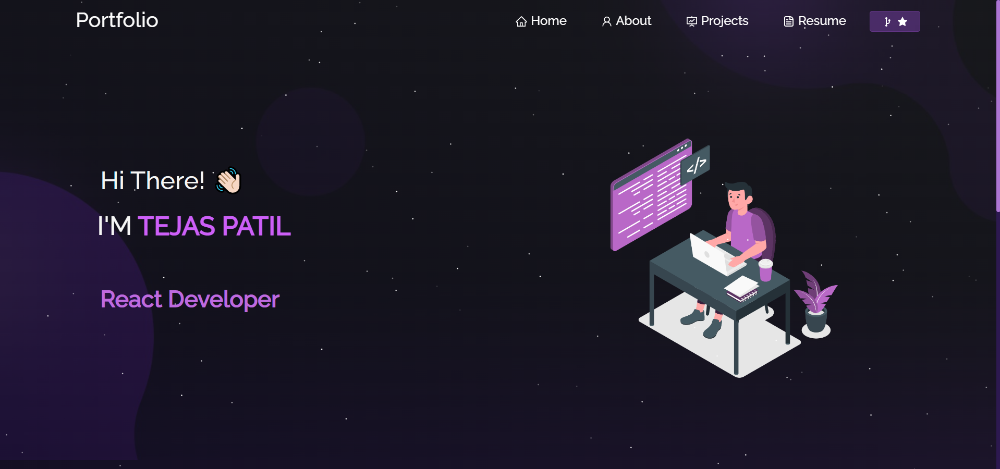

<h2 align="center">
  Portfolio Website <br/>
  <a href="https://tejasp-portfolio.netlify.app/" target="_blank">Tejas.Portfolio</a>
</h2>
<div align="center">
  
</div>

<br/>

<h3 align="center">
    🔹
    <a href="https://github.com/Tejasp1997/Portfolio/issues">Report Bug</a> &nbsp; &nbsp;
    🔹
    <a href="https://github.com/Tejasp1997/Portfolio/issues">Request Feature</a>
</h3>

## Built With

My personal portfolio <a href="https://tejasp-portfolio.netlify.app/" target="_blank">Tejas.Portfolio</a> which features some of my github projects as well as my resume and technical skills.<br/>

This project was built using these technologies.

- React.js
- Node.js
- CSS3
- VsCode
- Netlify

## Features

**📖 Multi-Page Layout**

**🎨 Styled with React-Bootstrap and Css with easy to customize colors**

**📱 Fully Responsive**


## 🚀 About Me
I'm a React, MERN, full stack developer...


## 🔗 Links
[](https://tejasp-portfolio.netlify.app/)
[](https://www.linkedin.com/in/tejas-patil-60a2a8184)
[](https://twitter.com/Tejasp97/)


## Getting Started

Clone down this repository. You will need `node.js` and `git` installed globally on your machine.

## 🛠 Installation and Setup Instructions

1. Installation: Install my-project with npm

```bash
  npm install my-project
  cd my-project
```

2. In the project directory, you can run: `npm start`

Runs the app in the development mode.\
Open [http://localhost:3000](http://localhost:3000) to view it in the browser.
The page will reload if you make edits.

## Usage Instructions

Open the project folder and Navigate to `/src/components/`. <br/>
You will find all the components used and you can edit your information accordingly.

